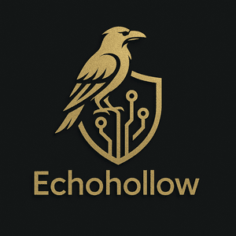

  

# EchoHollow Labs

> Malware Developer | Threat Analyst | Network Breaker | Cyber Offense & Defense Specialist

---

## 🛠️ Released Projects

### 🛰️ [ShadowDNS](https://github.com/echohollow/ShadowDNS) — OPSEC-Ready DNS Monitoring Framework

> **Status:** Released  
> 
> ShadowDNS captures and analyzes DNS traffic using multi-layer techniques (Scapy, raw sockets, ETL parsing) with stealth-first principles. Suspicious domains are detected via entropy analysis, heuristic matching, and forensic exportable artifacts.

✅ Real-time DNS capture and analysis  
✅ Entropy-based DGA detection  
✅ Exportable forensic reports  
✅ Built for Red Teams, Blue Teams, Threat Simulation

---

### 🛰️ [Ghost-NetFix](https://github.com/echohollow/Ghost-NetFix) — Stealth Network Restoration Tool

> Rapid network recovery tool for stealth operations on Kali Linux after MAC spoofing, NAT changes, or stealth boot environments.

✅ DNS resolver reinjection  
✅ External IP revalidation  
✅ Stealth-safe operation

---

### 🔄 [MACChanger-AutoLoop](https://github.com/echohollow/macchanger-autoloop) — Stealth MAC Rotation Script

> Automatic MAC address rotation framework for Kali Linux, supporting stealth operations with safe reversion on shutdown.

✅ Scheduled MAC changes  
✅ Network revalidation after each rotation  
✅ Suitable for red team wireless assessments

---

## 🚀 Active Development

### 🔗 [ClipFusionX](https://github.com/echohollow/ClipFusionX) — Clipboard Intelligence Weaponization Framework

> **Status:** In Active Development  
> 
> ClipFusionX is a real-time clipboard interception tool designed for adversarial simulation of crypto-wallet targeting and sensitive clipboard monitoring.

✅ Stealth clipboard monitoring  
✅ Cryptocurrency wallet interception research  
✅ Process hygiene and anti-forensic metadata cleanup

---

## 🧪 Upcoming Project

### 🪪 IdentDaemon — Dynamic Identity Obfuscation Agent

A lightweight stealth daemon that dynamically rotates system identity markers such as MAC address, hostname, DNS server IPs, clock skew, and User-Agent strings.

**Potential Use Cases:**
- Red team evasion of fingerprinting  
- Pentest operation stealth enhancement  
- Privacy researchers requiring resilient anonymity

> **Disclaimer:** IdentDaemon is intended for research, operational training, and privacy enhancement only.

---

## 📚 Blog

Interested in deeper research, operational notes, and development updates?  
➡️ [Visit the EchoHollow Labs Blog](/blog)

---

## 📬 Contact

For research inquiries or collaboration opportunities: [echohollow@tutamail.com](mailto:echohollow@tutamail.com)
